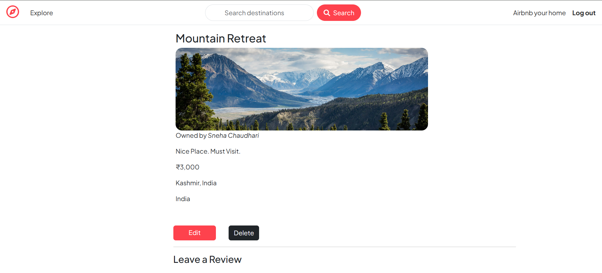
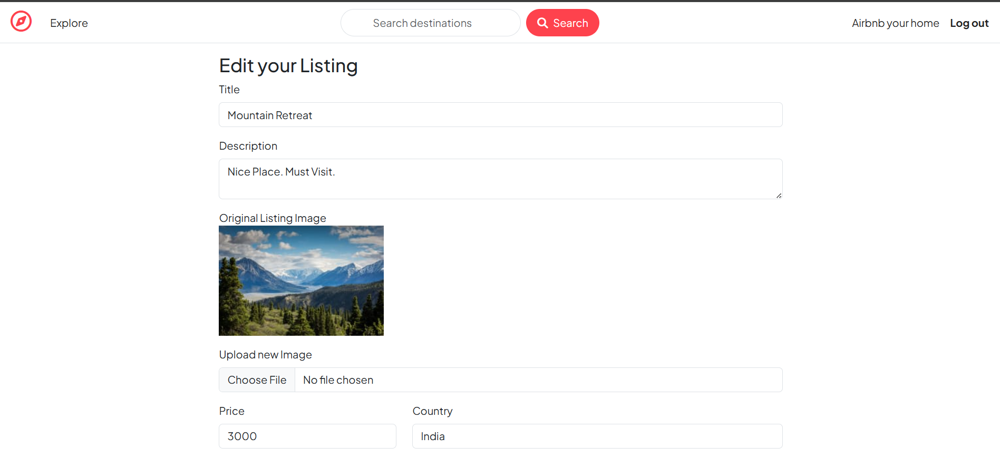
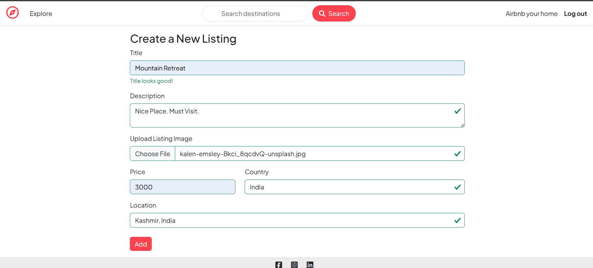
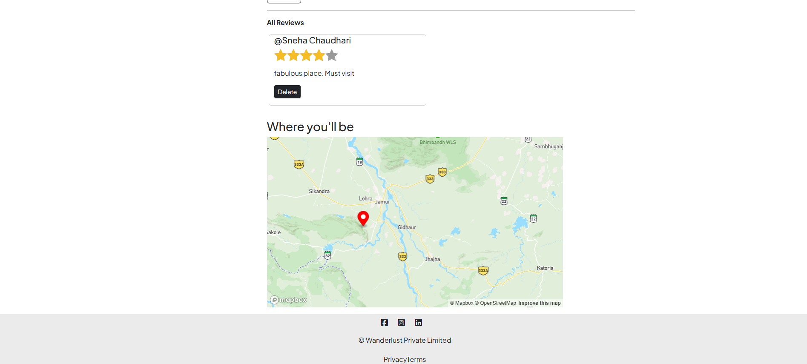

# 🏠 RentMySpace – Property Rental Platform---

## 🚀 Project Overview

**RentMySpace** is a full-stack web application inspired by platforms like Airbnb  designed to enable users to list, discover, and book rental properties seamlessly. Built using the **MEN STACK** (MongoDB, Express.js,  Node.js, EJS/HTML/CSS), the platform provides a smooth and secure experience for property owners and renters with real-time interactions and modern UI.

---

## 🌐 Deployment

👉 [https://wanderlust-majorproject-zde1.onrender.com/listings](https://wanderlust-majorproject-zde1.onrender.com/listings)

---

## 📖 Definition

A **Property Rental Management System** is a digital platform that allows users to list properties, browse available spaces.This project automates traditional rental processes, improving accessibility, transparency, and efficiency in property management.

---

## 🌟 Features

- **User Authentication** – Secure signup and login using JWT-based authentication and passport with password encryption.
- **Property Listings** – Users can create, edit, delete, and view rental property listings with images and descriptions.
- **Image Upload** – Property images are uploaded and stored securely using Cloudinary.
- **RESTful API Integration** – Efficient backend APIs for smooth frontend-backend communication.

---

## 🛠️ Tech Stack

**Frontend:**
- HMTL
- CSS
- EJS
- Bootstrap

**Backend:**
- Node.js
- Express.js
- MongoDB (Mongoose)
- JWT Authentication
- Cloudinary (Image Storage)

**Other Tools:**
- dotenv
- CORS
- Cookie-Parser
- Express-FileUpload

---

## 📦 Main Dependencies


**Server**
| Package | Purpose |
|---|---|
| express | Web framework |
| mongoose | MongoDB ODM |
| jsonwebtoken | JWT auth |
| bcrypt | Password hashing |
| cloudinary | Image storage |
| dotenv | Environment variables |
| cors | Cross-origin requests |
| cookie-parser | Cookie handling |
| express-fileupload | File uploads |

---

## 🏗️ How to Run

**1. Clone the repository**
```bash
git clone <your-repo-url>
cd RentMySpace
```

**2. Setup environment variables**

Create a `.env` file in the root and add:
```env
MONGO_URI=your_mongodb_connection_string
JWT_SECRET=your_jwt_secret
CLOUDINARY_CLOUD_NAME=your_cloud_name
CLOUDINARY_API_KEY=your_api_key
CLOUDINARY_API_SECRET=your_api_secret
```

**3. Install dependencies**

```bash
npm install
```

**4. Run the application**

```bash
node app.js
```

**5. Access the app**
[http://localhost:8080](http://localhost:8080)

---

## 💡 Response Examples

**Successful Listing Creation:**
```json
{
  "success": true,
  "message": "Listing created successfully",
  "data": {
    "title": "Cozy Apartment",
    "location": "Mumbai",
    "price": 2500
  }
}
```

**Error Example:**
```json
{
  "success": false,
  "message": "Unauthorized access"
}
```

---

## 📁 Folder Structure

RentMySpace/
├── controllers/          # Route handler functions
├── init/                 # Database initialization / seed data
├── models/               # Mongoose schemas & models
├── public/               # Static assets (CSS, JS, images)
├── routes/               # Express route definitions
├── uploads/              # Locally uploaded files
├── utils/                # Utility / helper functions
├── views/                # EJS / template files
├── .env                  # Environment variables
├── .gitignore            # Git ignored files
├── app.js                # Main application entry point
├── cloudConfig.js        # Cloudinary configuration
├── middleware.js         # Custom middleware
├── package-lock.json
└── package.json

## 🙏 Acknowledgements

- [React](https://reactjs.org/)
- [Node.js](https://nodejs.org/)
- [MongoDB](https://www.mongodb.com/)
- [Cloudinary](https://cloudinary.com/)

---

## 📸 Screenshots

### 🏠 Home Page


### 📋 Listings Page


### 📄 Editing Listing


### ➕ Create Listing


### 🔐 map Page
